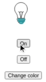
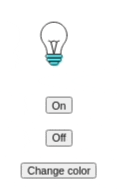
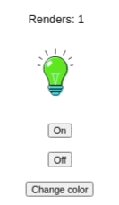
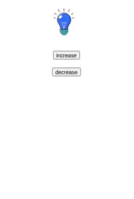
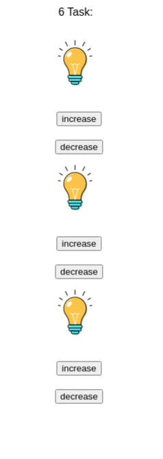

# To start :
node is required
1. `git clone https://github.com/pawk3k/react-redux-hooks-tutorial`
2. Go to directory
3. `npm install`
4. `npm run start`
5. go to `localhost:3000`

0. Before Each

Uncomment task and component in `App.js`  to see the result on localhost:3000. After finishing with one task comment previous and move to next.

---

1. `useState` Bulb
Go to file `Bulbs.js` 

In first Task you have to make bulb bulbs working by simply adding state.

.bulb-on 
.bulb-off 

Are css classes that are showing image of bulb on or off 

Here what you can see 

Expected:

---

2. `useEffect` Colored Bulb

Go to file `BulbsColored.js`

In this task you should add random color on item mounts only and add button to change this color. To achieve this use array of images provided in task and it's name as it was done in task 1.
⚠️ Warning
Be careful with dependencies for `useEffect` hook as it might trigger color change when it's not needed.
Here what can happen when dependencies are not correct:

Unexpected:

Expected:

---

3. `useRef` Auto Bulb 

Go to file `BulbAutomated.js`

Lets create render count for our component to see how many times our component render. The best way to achieve it is through immutable value inside `useEffect hook` as it is bind to each render

Expected:

---

# 4 `useReducer` SizeBulb

Go to file `BulbResizeAble.js

Lets imagine that some times we want to increase size of our bulb twice or decrease it size twice or change it's size by some multiplier , let's accomplish  this through adding `useReduce` hook and then we can add more interactions with our state if needed.

go to file `BulbResizable.js` and add missing to code 

# 5.`Context` UnequalBulbs

Go to file `UnequalBulbs.js`

Now we want make all of our bulbs to be synchronized to same size 

Go to file `UnequalBulbs.js` in this file you can see that we have our bulbs on different levels component tree and one of the possible solutions would be to pass props through all component hierarchy but 
we would do this in other way. Lets try to Use context and to access the value that is in the context

Expected:
All bulbs same size depending on store value

# 6. `Redux`

Go to file `ReduxBulbs.js`

But what if we wanted from one of our bulbs to change the the global size of all other  bulbs?
It is possible to do with React and it's API but in more complex apps `Redux` approach is preferable.

Go to file `ReduxBulbs` and try to fix it so every bulb could change size of all the bulbs

Expected behavior:

