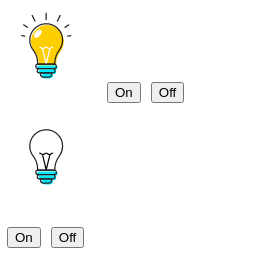
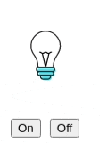

# To start :

In first Task you have to make bulb bulbs working by simply adding state.

.bulb-on 
.bulb-off 

Are css classes that are showing image of bulb on or off 

Here what you can see 

End result should be :

